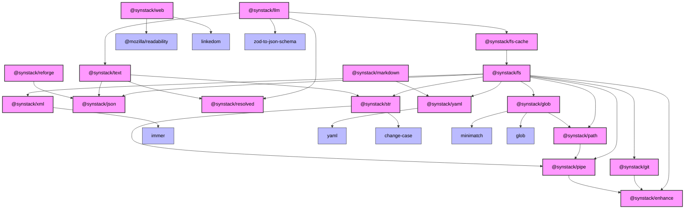

# Synstack

A collection of packages for fast iterations on LLM scripts, workflows, and applications. Synstack provides strongly-typed, chainable, and immutable APIs for common operations needed when building AI/LLM integrations.

## Want an example?

Check out the [reforge](https://github.com/pAIrprogio/synscript/tree/main/reforge) folder to see how we use synstack to build itself.

## Quick Start

Install these recommended packages:

```bash
npm install @synstack/llm @synstack/fs @synstack/text @synstack/fs-cache @synstack/xml

yarn add @synstack/llm @synstack/fs @synstack/text @synstack/fs-cache @synstack/xml

pnpm add @synstack/llm @synstack/fs @synstack/text @synstack/fs-cache @synstack/xml
```

## Packages

### Core Packages

#### AI/LLM Operations

- [@synstack/llm](./packages/llm/README.md) - Immutable, chainable, and type-safe wrapper of Vercel's AI SDK
  - Template-based message builders for different roles (system, user, assistant)
  - Support for text, images, and file handling in messages
  - Automatic MIME type detection and file processing

#### File System Operations

- [@synstack/fs](./packages/fs/README.md) - Strongly-typed, chainable file system operations

  - Support for multiple formats (JSON, YAML, XML)
  - Advanced path manipulation
  - Type-safe file operations with schema validation
  - Directory operations and file finding utilities

- [@synstack/fs-cache](./packages/fs-cache/README.md) - Human-friendly file system caching

  - Cache expensive function results between program runs
  - Type-safe disk caching with clean file system management
  - Readable cache entries

- [@synstack/git](./packages/git/README.md) - Git utilities for AI prompting and automation
  - List git-tracked files
  - View specific commit changes
  - Integration with fs package

#### System Utilities

- [@synstack/enhance](./packages/enhance/README.md) - Proxy-based utilities to enhance objects and functions
- [@synstack/glob](./packages/glob/README.md) - Type-safe glob pattern matching and file filtering

  - File finding with exclusion support
  - Pattern matching and capturing
  - Reusable filters

- [@synstack/path](./packages/path/README.md) - Advanced path manipulation utilities
  - Type-safe path resolution
  - Path relationships and manipulation
  - Extension handling and MIME type detection

### Content Processing

#### Web and Data Fetching

- [@synstack/web](./packages/web/README.md) - Web utilities for content processing
  - Fetch and validate JSON data with schema validation
  - Extract article content using Mozilla's Readability
  - Error handling for article extraction
  - Plain text content retrieval

#### Data Formats

- [@synstack/json](./packages/json/README.md) - Type-safe JSON operations with schema validation

  - Serialization with pretty printing
  - Type-safe deserialization
  - Zod schema validation

- [@synstack/yaml](./packages/yaml/README.md) - Type-safe YAML processing

  - Type-safe YAML deserialization
  - Zod schema validation

- [@synstack/xml](./packages/xml/README.md) - Non-ISO XML parser with text preservation

  - Handles invalid XML gracefully
  - Preserves original text structure
  - Simple node-based API

- [@synstack/markdown](./packages/markdown/README.md) - Type-safe markdown processing
  - HTML to markdown conversion
  - YAML frontmatter handling
  - Type-safe document management

#### Text Processing

- [@synstack/text](./packages/text/README.md) - Advanced string templating with async support
  - Parallel resolution of promises and arrays
  - Automatic indentation preservation and formatting
  - Support for callable values and non-string objects
  - Type-safe handling of embedded content blocks
- [@synstack/str](./packages/str/README.md) - Advanced chainable string manipulation

#### Functional Programming

- [@synstack/pipe](./packages/pipe/README.md) - Simple type-safe pipe utility
- [@synstack/resolved](./packages/resolved/README.md) - Piping utility preserving sync/async state

# Dependency Graph


