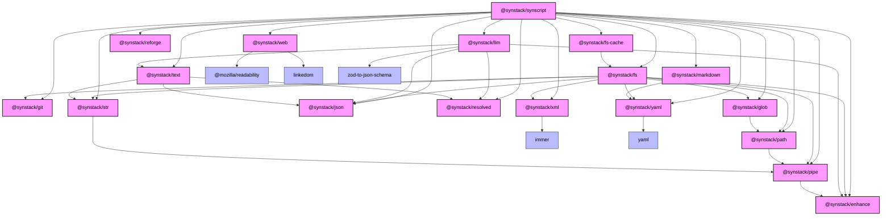

# SynStack / SynScript

> A collection of packages for fast iterations on LLM scripts, workflows, and applications

## Packages

### Bundle Package

- [@synstack/synscript](./packages/synscript/README.md) - The one for all package, includes bundled exports from all other packages

### Individual Packages

#### Data formats

- [@synstack/json](./packages/json/README.md) - Safe JSON serialization and deserialization
- [@synstack/xml](./packages/xml/README.md) - Lax, non spec-compliant XML utils tailored for LLMs
- [@synstack/yaml](./packages/yaml/README.md) - Safe and opiniated YAML serialization and deserialization

#### System Utilities

- [@synstack/enhance](./packages/enhance/README.md) - Utility functions for enhancing objects and functions with additional capabilities
- [@synstack/fs-cache](./packages/fs-cache/README.md) - File system caching with deep equality checks and automatic invalidation
- [@synstack/git](./packages/git/README.md) - Git operations with type-safe command building and execution
- [@synstack/glob](./packages/glob/README.md) - Type-safe glob pattern matching and file filtering utilities

#### Functional Programming

- [@synstack/pipe](./packages/pipe/README.md) - Simple typesafe pipe utility for Functional Programming
- [@synstack/resolved](./packages/resolved/README.md) - A piping utility which preserves the sync/async state of the value

#### Text and Document Processing

- [@synstack/llm](./packages/llm/README.md) - Type-safe LLM message handling with support for text, images, and tool calls
- [@synstack/markdown](./packages/markdown/README.md) - Type-safe markdown processing with YAML frontmatter support
- [@synstack/str](./packages/str/README.md) - Advanced chainable string manipulation
- [@synstack/text](./packages/text/README.md) - String templating as it was meant to be

#### Web Scraping

- [@synstack/web](./packages/web/README.md) - Web scraping utilities

# Dependency Graph

